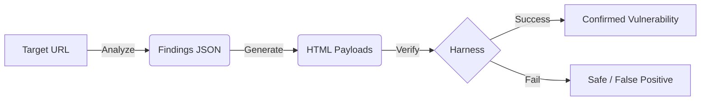

# How It Works: CSP Analyzer & Payload Generator

This document provides a technical deep dive into the inner workings of the CSP Analyzer project. It explains what happens under the hood when you run the code, whether via the Command Line Interface (CLI) or the Web GUI.

## System Architecture

The system is composed of three main stages that form a pipeline:

1.  **Analyzer**: Scans a target URL to identify Content Security Policy (CSP) weaknesses.
2.  **Generator**: Creates benign HTML payloads (exploits) tailored to the specific weaknesses found.
3.  **Harness (Verification)**: Tests the generated payloads against a mock server to confirm if they actually work.



---

## 1. The Analyzer (`csp_analyzer/`)

**Goal**: To fetch the CSP header from a website and parse it for known security gaps.

### When you run: `python -m csp_analyzer.cli --url ...`

1.  **Network Request**: The script sends an HTTP GET request to the provided URL.
2.  **Header Extraction**: It looks for the `Content-Security-Policy` header in the response.
3.  **Parsing**: The CSP string (e.g., `default-src 'self'; script-src *`) is parsed into a structured dictionary.
4.  **Rule Matching**: The analyzer checks the parsed policy against a set of rules:
    *   **`unsafe-inline`**: Does the policy allow inline scripts?
    *   **`unsafe-eval`**: Does it allow `eval()`?
    *   **Wildcards (`*`)**: Are there overly permissive wildcards in `script-src` or `object-src`?
    *   **Missing CSP**: Is the header completely absent?
5.  **Output**: It produces a `findings.json` file containing a list of "findings". Each finding describes a specific weakness (e.g., `TYPE_UNSAFE_INLINE`).

---

## 2. The Payload Generator (`payload_generator/`)

**Goal**: To create safe, benign proof-of-concept HTML files that demonstrate the vulnerabilities found by the Analyzer.

### When you run: `python -m payload_generator.cli --findings ...`

1.  **Input Loading**: It reads the `findings.json` file produced by the Analyzer.
2.  **Template Mapping**: For each finding, it selects an appropriate Jinja2 template from `payload_generator/templates/`.
    *   *Example*: If `unsafe-inline` was found, it selects the `T-INLINE-1` template.
3.  **Context Injection**: It fills the template with necessary data.
    *   *Safety*: It ensures that any external scripts linked are from the `allowlist.yaml` (e.g., only allowing scripts from your own demo domain).
4.  **Artifact Generation**: It writes HTML files to the `out/` directory.
    *   These HTML files contain "benign markers". Instead of stealing cookies, they simply set a global variable (e.g., `window.__PG_MARKER = true`).
5.  **Safety Checks**:
    *   **Dry Run**: By default, it runs in dry-run mode to prevent accidental writing of dangerous files.
    *   **Allowlist**: It strictly refuses to generate payloads pointing to unknown domains.

---

## 3. The Harness / Verification (`harness/` & `gui/`)

**Goal**: To prove that the generated payload actually executes in a browser environment with the target CSP enforced.

### When you run verification (via GUI or Script):

1.  **Mock Server Startup**:
    *   A local Flask server (`harness/mock_server.py`) is started on port 5001.
    *   This server is special: it serves the generated HTML payload BUT it forces the browser to respect the *original target's CSP*.
    *   This simulates hosting the vulnerable page on the victim's server.

2.  **Headless Browser (Playwright)**:
    *   The system launches a headless Chromium browser (invisible to you).
    *   It navigates to the Mock Server URL.

3.  **Execution Check**:
    *   The browser waits for the page to load.
    *   It checks the JavaScript environment for the benign marker: `window.__PG_MARKER`.
    *   **If `true`**: The CSP failed to block the script. The vulnerability is verified.
    *   **If `undefined`**: The CSP successfully blocked the script. The site is safe (or the exploit failed).

---

## Summary of Data Flow

1.  **User** inputs `https://example.com`.
2.  **Analyzer** sees `script-src 'unsafe-inline'`. -> Writes `finding: UNSAFE_INLINE`.
3.  **Generator** sees `finding: UNSAFE_INLINE`. -> Reads `T-INLINE-1` template (`<script>window.__PG_MARKER=1</script>`). -> Writes `payload.html`.
4.  **Harness** serves `payload.html` with header `Content-Security-Policy: script-src 'unsafe-inline'`.
5.  **Browser** loads page. Script executes. `window.__PG_MARKER` becomes `1`.
6.  **Result**: **VERIFIED VULNERABLE**.

---

## Deep Dive: Key Mechanisms

### 1. How does it choose the right template?

The system doesn't guess. It uses a strict mapping file: `payload_generator/mappings.py`.

*   **The Map**: There is a dictionary called `FINDING_TO_TEMPLATE`.
    ```python
    FINDING_TO_TEMPLATE = {
        "unsafe-inline": "T-INLINE-1",
        "blob_allowed":  "T-BLOB-1",
        # ...
    }
    ```
*   **The Process**:
    1.  The **Analyzer** outputs a finding type (e.g., `unsafe-inline`).
    2.  The **Generator** looks up this string in the map.
    3.  It finds `T-INLINE-1`.
    4.  It loads the corresponding Jinja2 template file (`templates/inline_marker.html.j2`).

### 2. The "Test Website" (Harness Injection)

You asked if it runs on a test website. **Yes, but it builds it on the fly.**

The **Harness** (`harness/runner.py`) and **Mock Server** (`harness/mock_server.py`) work together to simulate an attack:

1.  **The Stage**: The Mock Server serves a blank "victim" page at `http://localhost:5001`.
    *   Crucially, it accepts a `?csp=` query parameter to mimic *any* security policy.
    *   It contains an empty div: `<div id="injection-point"></div>`.

2.  **The Injection**: The Harness (using Playwright) visits this page.
    *   It takes the **generated payload** (the HTML snippet).
    *   It uses JavaScript to *force* that snippet into the `injection-point` div.
    *   `range.createContextualFragment(html)` is used to ensure scripts actually execute (standard `innerHTML` often blocks scripts).

3.  **The Result**:
    *   If the CSP allows it, the injected script runs and sets `window.__PG_MARKER`.
    *   If the CSP blocks it, the browser refuses to run the script, and the marker remains undefined.

This approach allows us to test *any* payload against *any* CSP without needing a real vulnerable application for every single test case.

---

## Implementation Challenges

Building a tool like this comes with several significant engineering hurdles:

### 1. The Complexity of CSP Logic
CSP is not a flat list of rules; it has complex inheritance and fallback mechanics.
*   **Fallback Logic**: If `script-src` is missing, the browser looks at `default-src`. If that's missing, it defaults to `*` (allowed). Implementing this logic accurately in the **Analyzer** to avoid false positives is difficult.
*   **Version Differences**: CSP Level 2 vs Level 3 handle things differently. For example, in CSP3, if a `nonce` is present, `unsafe-inline` is often ignored. The analyzer must understand these precedence rules.

### 2. Browser Fidelity (The Harness)
Simulating a browser environment reliably is hard.
*   **Race Conditions**: The **Harness** injects code into a running page. Sometimes the page loads too fast or too slow, or the injection happens before the DOM is ready.
*   **Context Differences**: A payload might work in a real attack (e.g., via a reflected URL parameter) but fail in our synthetic `innerHTML` injection because of how browsers handle script insertion (e.g., `innerHTML` scripts don't execute, so we use `createContextualFragment`).

### 3. Safe Payload Generation
The **Generator** must be strictly benign.
*   **Sanitization**: We must ensure that user inputs (like findings) cannot be manipulated to generate malicious output.
*   **Allowlisting**: We have to strictly enforce that "trusted host" payloads only point to our own demo domains, never to arbitrary third-party sites, to prevent the tool from being used for real attacks.

### 4. Dynamic vs. Static Analysis
*   The **Analyzer** performs *static analysis* of the header. It doesn't know if the server changes the header based on the user agent, cookies, or path.
*   A "perfect" tool would need to crawl the site and observe headers in multiple contexts, which adds massive complexity.

---

## Real World Context: Defense in Depth

You asked a great question: **"Do popular domains with weak CSPs get hacked all the time?"**

The answer is **no**, because CSP is rarely the *only* defense. It is part of a **Defense in Depth** strategy.

1.  **Primary Defenses (The Shield)**:
    *   **Input Sanitization**: Most backends strictly filter user input to remove dangerous characters like `<` or `>`.
    *   **Modern Frameworks**: Tools like React, Vue, and Angular automatically "escape" content. Even if you try to inject `<script>alert(1)</script>`, these frameworks render it as harmless text, not executable code.
    *   **HttpOnly Cookies**: Critical session cookies are often flagged as `HttpOnly`, meaning JavaScript (even malicious script) cannot read them.

2.  **CSP (The Safety Net)**:
    *   CSP is designed to catch the cases where the Primary Defenses **fail**.
    *   If a developer accidentally uses `dangerouslySetInnerHTML` (React) or forgets to sanitize an input, a **Strong CSP** stops the attack.
    *   A **Weak CSP** (like `unsafe-inline`) means that *if* a hole exists, the safety net is broken, and the attack will succeed.

**Conclusion**: A weak CSP doesn't mean a site is currently vulnerable, but it means it is **fragile**. One small developer mistake could lead to a full compromise.
